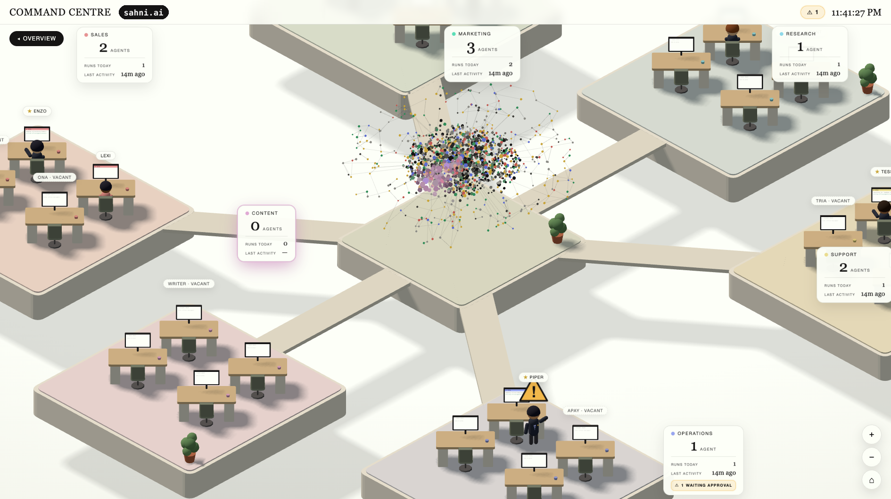

# Command Centre



A 3D isometric office for your own Claude Code agents. Departments are floating
pods, your agents are little people at desks, and everything on screen is real:
live runs, live chat, live approvals. You hire agents, drop tasks in their
inboxes, and nothing outbound leaves the building until you approve it.

**License, in plain English:** free for personal and internal use. You may not
sell it, resell it, or build a paid product on it. (Formal terms: PolyForm
Noncommercial 1.0.0 — see [LICENSE](LICENSE).)

**Runs on your own Claude login** (Pro or Max). No API key, no separate billing —
agent sessions are headless Claude Code sessions on the account you're already
paying for.

> **Windows:** supported, early — the code is complete but hasn't been verified
> on real Windows hardware yet. If something breaks, please report it.

---

## What you need

- **macOS** (or Linux), or **Windows** (early — see above)
- **Node.js 20+** — https://nodejs.org
- **git**
- **Claude Code**, logged in with your Pro/Max account (setup installs it if missing)
- Comfort with a terminal. Setup is honest, not magic.

## Install

**macOS / Linux**

```bash
git clone https://github.com/ajsahni/agents-office.git
cd agents-office
./setup
```

**Windows (PowerShell)**

```powershell
git clone https://github.com/ajsahni/agents-office.git
cd agents-office
powershell -ExecutionPolicy Bypass -File .\setup.ps1
```

Setup checks your tools, installs dependencies, creates the `office/` folder
(where ALL your data lives — it's gitignored, so `git pull` never touches it),
copies the example config, and does a first boot check.

## Your office, in one file

`office.config.json` at the repo root is the whole shape of your office:

```json
{
  "port": 4477,
  "brain": null,
  "departments": [
    { "name": "Research", "agents": ["scout", "digger"] },
    { "name": "Content",  "agents": ["writer"] }
  ]
}
```

- Up to **6 departments**, up to **4 agents each**. Colours are assigned
  automatically — you don't pick them.
- Agents listed here but not yet hired render as **vacant desks**. Click one to
  hire from inside the office.
- **`brain`** is optional. Point it at a folder (e.g. `"office/brain"`) and it
  becomes your agents' shared knowledge base: a Brain pod appears in the office,
  agents can read and write it, and if the folder is a git repo every agent run
  is journal-committed (and pushed, if it has a remote). Leave it `null` and
  nothing brain-related exists.

## Daily driving

```bash
bin/office start        # the office: UI server + scheduler (leave it running)
```

Open **http://localhost:4477**. Then:

- **Hire** — click any vacant desk (or `bin/office new-agent`). You give each
  agent a name, a department, a schedule, a model, and a job description; that
  becomes its `CLAUDE.md` in `office/agents/<name>/`, which you can edit any time.
- **Give work** — drop a markdown task file in `office/inbox/<name>/`. Scheduled
  runs pick up the oldest open task. An empty inbox means no session is started —
  your usage window is respected.
- **Chat** — click an agent at its desk. Chat goes straight into its live session
  (or resumes its last one).
- **Approve** — when an agent wants to do something outbound (like send an
  email), it queues an approval and stands up waving under a ⚠. You approve or
  reject (with notes) from its chat. What's released is **exactly** what you
  approved — changed arguments require a fresh approval. Approved "sends" land
  in the agent's `outbox/` folder as records; wire a real sender when you're ready.
- **Settings** — per-agent model/effort in the agent's SETTINGS tab, plus a
  token/est-cost readout for today.
- **CLI** — `bin/office status | run <agent> | chat <agent> <msg> | approve <id> | pause | resume`

## Schedules

Each agent's `manifest.yaml` carries its triggers:

```yaml
schedule:
  triggers: [ { type: cron, when: "0 9 * * 1-5" } ]   # 5-field cron
  missed_run: once        # catch up one missed slot after sleep/wake
  max_runs_per_day: 4
  workday: { start: "08:00", end: "18:00", days: [1,2,3,4,5] }
```

An agent with 2+ undecided approvals gets no new scheduled runs until you clear
the queue.

## What agents can and can't do

- **Reads**: their own workspace (`office/`) and the brain. Nothing else.
- **Writes**: their own folder, the inbox, and the brain. Enforced by the
  permission gate, not by politeness.
- **No shell, no web browsing** in v1 — file tools and MCP only.
- **MCP**: agents may use any MCP servers **you** configure — drop a `.mcp.json`
  in an agent's folder. The UI shows nothing about MCP; tools just work.
- **Outbound** (send_email) is hard-blocked until you approve each exact request.

## Keep it running (optional)

`bin/office start` runs in a terminal. If you want it to survive reboots:

<details>
<summary>macOS — launchd sample</summary>

Save as `~/Library/LaunchAgents/com.commandcentre.daemon.plist` (fix the two
paths), then `launchctl bootstrap gui/$(id -u) <that file>`:

```xml
<?xml version="1.0" encoding="UTF-8"?>
<!DOCTYPE plist PUBLIC "-//Apple//DTD PLIST 1.0//EN" "http://www.apple.com/DTDs/PropertyList-1.0.dtd">
<plist version="1.0"><dict>
  <key>Label</key><string>com.commandcentre.daemon</string>
  <key>ProgramArguments</key><array>
    <string>/usr/local/bin/node</string>
    <string>/FULL/PATH/TO/command-centre/bin/office</string>
    <string>start</string>
  </array>
  <key>RunAtLoad</key><true/>
  <key>KeepAlive</key><true/>
  <key>StandardOutPath</key><string>/tmp/commandcentre.log</string>
  <key>StandardErrorPath</key><string>/tmp/commandcentre.err</string>
</dict></plist>
```
</details>

<details>
<summary>Windows — Task Scheduler sample</summary>

```powershell
schtasks /Create /TN "Command Centre" /SC ONLOGON /TR "node C:\FULL\PATH\command-centre\bin\office start"
```
</details>

## Troubleshooting

- **Blank page / "UI not built"** — `npm run build:ui`, reload.
- **"Can't reach the daemon"** — is `bin/office start` running? Right port?
- **Agent won't run** — is Claude Code logged in? Run `claude` once in a terminal.
- **Port already in use** — change `port` in `office.config.json`, restart.
- **Config warnings in the top bar** — hover the ⚠ tag; usually an agent listed
  in config with no folder yet (that's just a vacant desk waiting for a hire).

## The shape of things

```
office.config.json      your office (departments, agents, brain, port)
office/agents/<name>/   an agent: CLAUDE.md (its job) · manifest.yaml · memory.md · out/
office/inbox/<name>/    task files you drop in
office/state/<name>/    events, sessions, approvals, outbox — the daemon's records
office/brain/           optional shared knowledge base
daemon/ ui/ bin/        the machine (yours to read; PRs welcome)
```
